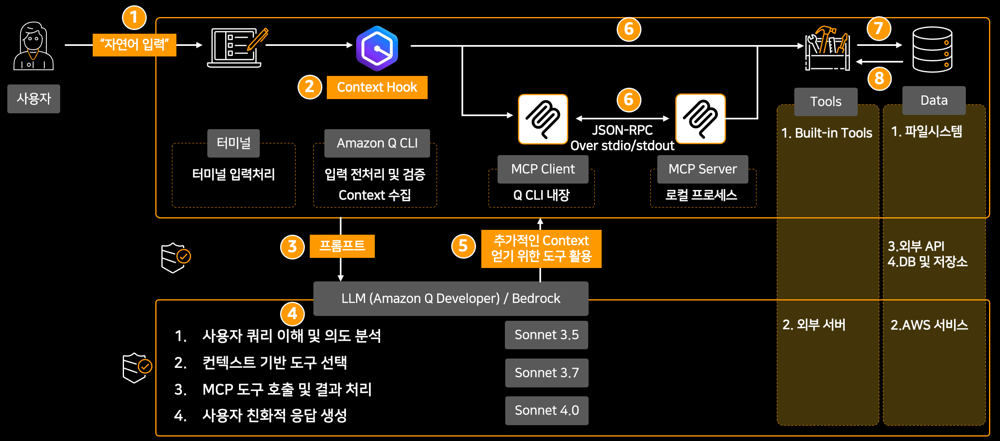

# 15. 아키텍쳐 분석하기

## 🧩 아키텍쳐 분석하기

이 랩은 현재 계정에 대한 아키텍쳐를 Amazon Q CLI를 활용해서 AWS 모범사례에 맞추어 분석을 하고, 리포트를 생성하는 랩입니다.

### 🧪 랩 목표

이 랩을 통해 다음과 같은 내용을 학습할 수 있습니다:

1. Amazon Q CLI를 사용하여 아키텍쳐 전체 분석 하는 방법
2. 효과적인 프롬프트와 Context를 사용하는 방법
3. 대규모 자원을 효과적으로 분석하는 방법

### 🧪 Step1:  Profile/Context 구성

✅  네트워크 운영자를 위한 Profile과 Context를 구성해 봅니다.

```
mkdir ~/projects
mkdir ~/projects/architect
mkdir ~/projects/architect/rules
cat > ~/projects/architect/rules/architect.md << 'EOF'
### 📋 01단계: 역할 및 환경 설정 프롬프트

AWS 계정 종합 분석을 위한 환경을 설정해줘.

시니어 클라우드 아키텍트 역할로 다음 환경을 구성해줘:
- Primary Region: ap-northeast-2 (Seoul)
- Analysis Scope: 전체 AWS 계정 리소스
- Report Language: 한국어 (기술 용어 영어 병기)

먼저 현재 환경을 확인하고:
1. Python 3.7+ 및 pip3 설치 상태 확인
2. AWS CLI v2 및 자격 증명 확인 (aws sts get-caller-identity 실행)
3. 필요한 Python 패키지 설치 (markdown, beautifulsoup4, pygments)
4. script/check-environment.sh가 있으면 실행해서 환경 검증

환경 설정이 완료되면 분석 준비 완료 상태를 확인해줘.


### 📊 02단계: 데이터 수집 프롬프트

AWS 계정의 모든 리소스 데이터를 종합적으로 수집해줘.

script/collect_all_data.py를 실행해서 다음 9개 영역의 데이터를 수집해줘:
1. 네트워킹: VPC, 서브넷, 보안그룹, 라우팅 등
2. 컴퓨팅: EC2, EKS, Auto Scaling, Load Balancer 등
3. 컨테이너: ECS, EKS, ECR, Kubernetes 리소스 등
4. 스토리지: EBS, S3, EFS, FSx, Backup 등
5. 데이터베이스: RDS, Aurora, ElastiCache, DynamoDB 등
6. 보안: IAM, KMS, Secrets Manager, GuardDuty 등
7. 애플리케이션: API Gateway, Lambda, SNS, SQS 등
8. 모니터링: CloudWatch, X-Ray, Config 등
9. IaC 분석: CloudFormation, 태그 분석 등

실행 중 다음 사항을 모니터링해줘:
- 실시간 진행 상황 및 소요 시간 표시
- 성공/실패 통계 및 상세 결과 제공
- 타임아웃 처리 (스크립트당 5분)
- 최종 요약 보고서 자동 생성

수집된 데이터는 ~/amazonqcli_lab/aws-arch-analysis/report/ 디렉토리에 JSON 형태로 저장되는지 확인해줘.


### 📋 03단계: Enhanced 보고서 생성 프롬프트

수집된 AWS 데이터를 기반으로 Enhanced 보고서 10개를 생성해줘.

다음 Enhanced 보고서를 데이터 기반의 정량적 권장사항과 함께 생성해줘:

1. 01-executive-summary.md (경영진 요약)
   - generate-executive-summary.py 실행
   - C-Level 임원진을 위한 고수준 요약
   - 비용 현황, 주요 발견사항, ROI 기반 권장사항

2. 02-networking-analysis.md (네트워킹 분석)
   - generate-networking-report.py 실행
   - SSH 접근 제한, NAT Gateway 최적화, VPC Flow Logs 활성화

3. 03-compute-analysis.md (컴퓨팅 분석)
   - generate-compute-report.py 실행
   - 미사용 EC2 정리, Reserved Instance 활용, 인스턴스 타입 최적화

4. 04-storage-analysis.md (스토리지 분석)
   - generate_storage_report.py 실행
   - 미사용 EBS 볼륨 정리, S3 스토리지 클래스 최적화

5. 05-database-analysis.md (데이터베이스 분석)
   - generate-database-report.py 실행
   - RDS 최적화, Multi-AZ 설정, 백업 정책 개선

6. 06-security-analysis.md (보안 분석)
7. 07-monitoring-analysis.md (모니터링 분석)
8. 08-application-analysis.md (애플리케이션 분석)
9. 09-cost-analysis.md (비용 분석)
10. 10-recommendations.md (종합 권장사항)

각 보고서는 다음 Enhanced 권장사항 시스템을 적용해줘:
- 🔴 높은 우선순위 (즉시 실행): 보안 위험, 높은 비용 영향
- 🟡 중간 우선순위 (1-3개월): 성능 개선, 중간 비용 영향
- 🟢 낮은 우선순위 (3-6개월): 운영 효율성, 장기적 개선

각 권장사항에는 구체적인 비용 절감액, 영향받는 리소스 수, 구현 난이도를 포함해줘.


### 🎨 04단계: HTML 변환 프롬프트

생성된 10개의 Markdown 보고서를 전문적인 HTML 형식으로 변환해줘.

다음 목표를 달성해줘:
✅ 10개 Markdown 파일을 10개 HTML 파일로 완전 변환
✅ index.html + 10개 보고서 = 총 11개 HTML 파일 생성
✅ assets 폴더 (CSS, JS) 완전 구성
✅ 고급 Markdown 포맷팅 완벽 변환
✅ 전문적인 스타일링 적용

실행 순서:
1. script/convert-md-to-html-simple.sh 실행 (기본 변환)
2. script/generate-html-reports.sh 실행 (index.html과 assets 생성)
3. script/validate-html-conversion.sh 실행 (변환 검증)

변환해야 할 파일들:
- 01-executive-summary.md → 01-executive-summary.html
- 02-networking-analysis.md → 02-networking-analysis.html
- 03-compute-analysis.md → 03-compute-analysis.html
- 04-storage-analysis.md → 04-storage-analysis.html
- 05-database-analysis.md → 05-database-analysis.html
- 06-security-analysis.md → 06-security-analysis.html
- 07-application-analysis.md → 07-application-analysis.html
- 08-monitoring-analysis.md → 08-monitoring-analysis.html
- 09-cost-optimization.md → 09-cost-optimization.html
- 10-recommendations.md → 10-recommendations.html

최종 확인 사항:
- HTML 파일 개수: 정확히 11개
- 각 파일 크기: 8KB-35KB (적절한 내용 포함)
- Markdown 포맷팅 완벽 변환 (**볼드**, *이탤릭*, 테이블, 리스트)
- 전문적 스타일: 그라데이션 헤더, 호버 효과, 권장사항 박스
- 네비게이션 링크: 모든 파일에 포함

변환 완료 후 ~/amazonqcli_lab/aws-arch-analysis/report/html/ 디렉토리에 모든 파일이 생성되었는지 확인해줘.


### 🔄 통합 실행 프롬프트 (전체 프로세스)

AWS 계정 종합 분석을 01~04 단계로 완전 자동화해서 실행해줘.

전체 프로세스를 순차적으로 실행해줘:

**01단계: 환경 설정**
- 시니어 클라우드 아키텍트 역할 설정
- Primary Region: ap-northeast-2
- Python, AWS CLI, 필수 패키지 확인
- script/check-environment.sh 실행

**02단계: 데이터 수집**
- script/collect_all_data.py 실행
- 9개 영역 AWS 리소스 데이터 수집
- 진행 상황 모니터링 및 결과 확인

**03단계: Enhanced 보고서 생성**
- 10개 Markdown 보고서 생성
- 데이터 기반 정량적 권장사항 포함
- 우선순위별 분류 (높음/중간/낮음)

**04단계: HTML 변환**
- 10개 HTML 보고서 + index.html 생성
- 전문적 스타일링 적용
- assets 폴더 완전 구성

각 단계 완료 후 결과를 확인하고 다음 단계로 진행해줘.
최종적으로 ~/amazonqcli_lab/aws-arch-analysis/report/html/에 11개의 완성된 HTML 보고서가 생성되어야 해.

### 💡 문제 해결 프롬프트

AWS 계정 분석 과정에서 문제가 발생했어. 다음 사항들을 체계적으로 확인하고 해결해줘:

**환경 관련 문제:**
1. AWS 권한 오류 시: aws sts get-caller-identity로 자격 증명 확인
2. Python 패키지 오류 시: pip3 install markdown beautifulsoup4 pygments --user
3. Steampipe 연결 오류 시: steampipe service status 확인

**데이터 수집 문제:**
1. 타임아웃 오류 시: 개별 스크립트로 재실행
2. 부분 실패 시: 실패한 영역만 개별 수집
3. 권한 부족 시: IAM 정책 확인

**HTML 변환 문제:**
1. 변환 실패 시: script/validate-html-conversion.sh 실행
2. 스타일링 문제 시: script/troubleshoot-html-conversion.sh 실행
3. 파일 누락 시: script/generate-html-reports.sh 재실행

각 문제에 대한 구체적인 해결 방법을 제시하고 실행해줘.
EOF
```


✅ Amazon Q Chat에서 Profile과 Context 구성하기:

Architect를 위한 프로파일을 생성합니다.

```bash
/profile create architect
```

앞서 생성한 EC2 운영자를 위한 context를 ec2ops 프로파일에 연결 구성합니다.

```
/context add ~/projects/architect/rules/architect.md
```

아래 명령을 통해서 정상적으로 context가 입력되었는지 확인합니다.

```
/context show
```

출력 예시:

```
[architect] > /context show


🌍 global:
    .amazonq/rules/**/*.md 
    README.md (1 match)
    AmazonQ.md 

👤 profile (architect):
    ~/projects/architect/rules/architect.md (1 match)

2 matched files in use:
🌍 /home/ec2-user/amazonqcli_lab/aws-arch-analysis/README.md (~3600 tkns)
👤 /home/ec2-user/projects/architect/rules/architect.md (~1800 tkns)

Total: ~5400 tokens
```

### 🧪 Step2: 아키텍쳐를 상세하게 분석하기&#x20;

🎯 목표: 현재 아키텍쳐를 사전에 정의된 Context와 프롬프트로 상세하게 분석해 봅니다.&#x20;

💬 프롬프트 예시:

```
home/ec2-user/amazonqcli_lab/aws-arch-analysis/prompt 의 4단계를 수행해줘.
1단계. 01-role-and-environment.md
2단계. 02-data-collection-guide.md
3단계. 03-report-generation-guide.md
4단계. 04-html-conversion-guide.md
```

출력예시:

```
생략...

✅ 1단계 완료: 역할 및 환경 설정
• 시니어 클라우드 아키텍트 역할 설정 완료
• Primary Region: ap-northeast-2 (Seoul)
• Python 3.9.23 및 필수 패키지 설치 완료
• AWS CLI v2 및 자격 증명 확인 완료
• Steampipe 및 플러그인 설치 확인 완료

중략...

[16:31:33] 🎯 AWS 계정 종합 데이터 수집 시작 (순차 처리)
[16:31:33] 📁 데이터 저장 위치: /home/ec2-user/amazonqcli_lab/aws-arch-analysis/report
[16:31:33] 📊 수집 대상: 10개 영역

[16:31:33] [1/10] 네트워킹 영역 처리 중...
[16:31:33] 🚀 네트워킹 데이터 수집 시작...
[16:32:50] ✅ 네트워킹 데이터 수집 완료 (76.2초)

[16:32:51] [2/10] 컴퓨팅 영역 처리 중...
[16:32:51] 🚀 컴퓨팅 데이터 수집 시작...
[16:35:53] ✅ 컴퓨팅 데이터 수집 완료 (182.1초)

[16:35:54] [3/10] 컨테이너 영역 처리 중...
[16:35:54] 🚀 컨테이너 데이터 수집 시작...
[16:37:03] ✅ 컨테이너 데이터 수집 완료 (68.8초)

[16:37:04] [4/10] 스토리지 영역 처리 중...
[16:37:04] 🚀 스토리지 데이터 수집 시작...
[16:38:34] ✅ 스토리지 데이터 수집 완료 (90.6초)

[16:38:35] [5/10] 데이터베이스 영역 처리 중...
[16:38:35] 🚀 데이터베이스 데이터 수집 시작...
[16:39:29] ✅ 데이터베이스 데이터 수집 완료 (54.1초)

[16:39:30] [6/10] 보안 영역 처리 중...
[16:39:30] 🚀 보안 데이터 수집 시작...
[16:40:37] ✅ 보안 데이터 수집 완료 (66.7초)

[16:40:38] [7/10] 애플리케이션 영역 처리 중...
[16:40:38] 🚀 애플리케이션 데이터 수집 시작...
[16:43:13] ✅ 애플리케이션 데이터 수집 완료 (155.0초)

[16:43:14] [8/10] 모니터링 영역 처리 중...
[16:43:14] 🚀 모니터링 데이터 수집 시작...
[16:43:19] ✅ 모니터링 데이터 수집 완료 (5.4초)

[16:43:20] [9/10] 비용 분석 영역 처리 중...
[16:43:20] 🚀 비용 분석 데이터 수집 시작...
[16:44:34] ✅ 비용 분석 데이터 수집 완료 (73.4초)

[16:44:35] [10/10] IaC 분석 영역 처리 중...
[16:44:35] 🚀 IaC 분석 데이터 수집 시작...
[16:44:53] ✅ IaC 분석 데이터 수집 완료 (18.0초)

================================================================================
[16:44:53] 📊 AWS 데이터 수집 완료 요약
================================================================================
🕐 총 소요 시간: 0:13:19.330270
✅ 성공: 10/10
❌ 실패: 0/10

✅ 네트워킹         (76.2초) - success
✅ 컴퓨팅          (182.1초) - success
✅ 컨테이너         (68.8초) - success
✅ 스토리지         (90.6초) - success
✅ 데이터베이스       (54.1초) - success
✅ 보안           (66.7초) - success
✅ 애플리케이션       (155.0초) - success
✅ 모니터링         (5.4초) - success
✅ 비용 분석        (73.4초) - success
✅ IaC 분석       (18.0초) - success

[16:44:53] 📁 생성된 파일: JSON 139개, 로그 12개
[16:44:53] 💾 총 데이터 크기: 1.5 MB

[16:44:53] 🎉 AWS 계정 종합 데이터 수집이 완료되었습니다!
[16:44:53] 📂 수집된 데이터 위치: /home/ec2-user/amazonqcli_lab/aws-arch-analysis/report

> ✅ 2단계 완료: 데이터 수집
• 총 소요 시간: 13분 19초
• 성공률: 10/10 (100%)
• 생성된 파일: JSON 139개, 로그 12개
• 총 데이터 크기: 1.5 MB
• 9개 영역의 AWS 리소스 데이터 수집 완료

생략...

 ↳ Purpose: 생성된 보고서 확인

-rw-rw-r--. 1 ec2-user ec2-user  2389 Jul 22 16:46 01-executive-summary.md
-rw-rw-r--. 1 ec2-user ec2-user 10944 Jul 22 16:47 02-networking-analysis.md
-rw-rw-r--. 1 ec2-user ec2-user 10419 Jul 22 16:47 03-compute-analysis.md
-rw-rw-r--. 1 ec2-user ec2-user  5617 Jul 22 16:46 04-storage-analysis.md
-rw-rw-r--. 1 ec2-user ec2-user  1775 Jul 22 16:46 05-database-analysis.md
-rw-rw-r--. 1 ec2-user ec2-user  4289 Jul 22 16:46 06-security-analysis.md
-rw-rw-r--. 1 ec2-user ec2-user  8133 Jul 22 16:46 07-cost-optimization.md
-rw-rw-r--. 1 ec2-user ec2-user  4516 Jul 22 16:46 08-application-analysis.md
-rw-rw-r--. 1 ec2-user ec2-user  6688 Jul 22 16:46 09-monitoring-analysis.md
-rw-rw-r--. 1 ec2-user ec2-user  5582 Jul 22 16:46 10-recommendations.md


> ✅ 3단계 완료: Enhanced 보고서 생성
• 총 10개의 Markdown 보고서 생성 완료
• Enhanced 권장사항 시스템 적용 (우선순위별 분류)
• 데이터 기반 정량적 권장사항 포함
• 생성된 보고서 크기: 1.7KB ~ 10.9KB
... 생략 ...
📊 Step 1: HTML 파일 개수 검증
생성된 HTML 파일: 11개
✅ HTML 파일 개수: 11개 (정상)

📋 Step 2: 개별 파일 존재 확인
✅ index.html (메인 대시보드)
✅ 01-executive-summary.html (경영진 요약)
✅ 02-networking-analysis.html (네트워킹 분석)
✅ 03-compute-analysis.html (컴퓨팅 분석)
✅ 04-storage-analysis.html (스토리지 분석)
✅ 05-database-analysis.html (데이터베이스 분석)
✅ 06-security-analysis.html (보안 분석)
✅ 07-cost-optimization.html (비용 최적화)
✅ 08-application-analysis.html (애플리케이션 분석)
✅ 09-monitoring-analysis.html (모니터링 분석)
✅ 10-recommendations.html (종합 권장사항)
생략...
> ✅ 4단계 완료: HTML 변환
• 총 11개 HTML 파일 생성 완료 (index.html + 10개 보고서)
• 파일 크기: 10KB ~ 27KB (적절한 내용 포함)
• Assets 폴더 완전 구성 (CSS, JS 파일)
• 네비게이션 링크 포함
• 압축 파일 생성 완료 (ZIP: 53KB, TAR.GZ: 25KB)

━━━━━━━━━━━━━━━━━━━━━━━━━━━━━━━━━━━━━━━━━━━━━━━━━━━━━━━━━━

## 🎉 AWS 계정 종합 분석 4단계 완료 요약

### ✅ 전체 프로세스 성공적 완료

📊 최종 결과:
• **총 소요 시간**: 약 25분
• **데이터 수집**: 139개 JSON 파일, 1.5MB
• **보고서 생성**: 10개 Markdown 보고서
• **HTML 변환**: 11개 HTML 파일 (index.html + 10개 보고서)

### 📋 단계별 성과

#### 🎯 1단계: 역할 및 환경 설정 ✅
• 시니어 클라우드 아키텍트 역할 설정
• Python 3.9.23 + 필수 패키지 설치
• AWS CLI v2 + 자격 증명 확인
• Steampipe + 플러그인 설치 확인

#### 📊 2단계: 데이터 수집 ✅
• **성공률**: 10/10 (100%)
• **수집 영역**: 네트워킹, 컴퓨팅, 컨테이너, 스토리지, 데이터베이스, 보안, 애플리케이션, 모니터링, 비용, IaC
• **생성 파일**: JSON 139개, 로그 12개
• **데이터 크기**: 1.5MB

#### 📋 3단계: Enhanced 보고서 생성 ✅
• **생성 보고서**: 10개 Markdown 파일
• **Enhanced 권장사항**: 우선순위별 분류 (높음/중간/낮음)
• **데이터 기반**: 정량적 권장사항 포함
• **파일 크기**: 1.7KB ~ 10.9KB

#### 🎨 4단계: HTML 변환 ✅
• **HTML 파일**: 11개 (index.html + 10개 보고서)
• **파일 크기**: 10KB ~ 27KB
• **Assets 구성**: CSS 3개, JS 4개, JSON 3개
• **압축 파일**: ZIP (53KB), TAR.GZ (25KB)
```

### 🧪 Step3: 생성된 리포트를 상세하게 분석하기&#x20;

아래와 같은  HTML 리포트가 생성됩니다. 각 리포트들은 링크가 연결되므로 각 리포트들을 확인해 봅니다.

HTML 보고서 (11개):

1. index.html - 메인 대시보드
2. 01-executive-summary.html - 경영진 요약
3. 02-networking-analysis.html - 네트워킹 분석
4. 03-compute-analysis.html - 컴퓨팅 분석
5. 04-storage-analysis.html - 스토리지 분석
6. 05-database-analysis.html - 데이터베이스 분석
7. 06-security-analysis.html - 보안 분석
8. 07-cost-optimization.html - 비용 최적화
9. 08-application-analysis.html - 애플리케이션 분석
10. 09-monitoring-analysis.html - 모니터링 분석
11. 10-recommendations.html - 종합 권장사항

<figure><figcaption></figcaption></figure>


